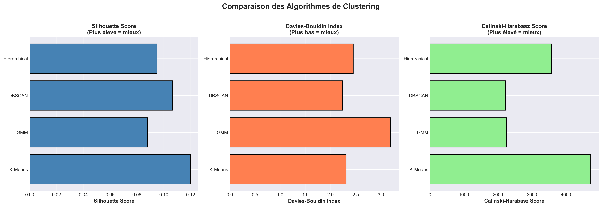
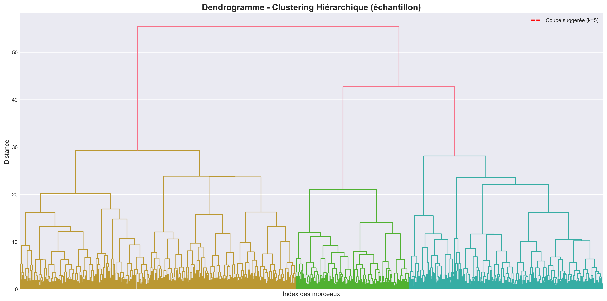
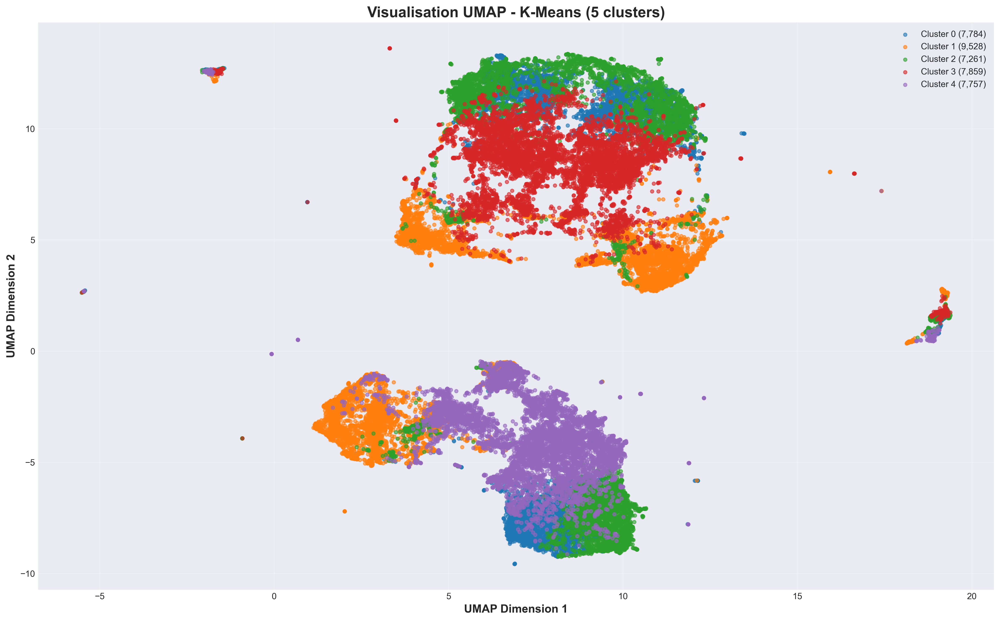
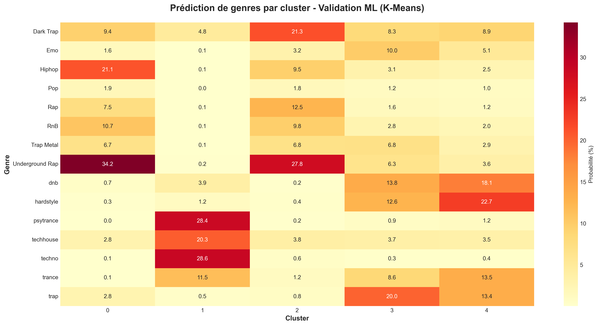

# Clustering Musical Spotify

Identification automatique de profils musicaux par clustering non-supervisé sur 42 305 morceaux Spotify.

## Contexte économique

Les plateformes de streaming musical font face à un défi coûteux : organiser des catalogues de 100 millions de morceaux pour créer des recommandations personnalisées. L'étiquetage manuel par des experts musicaux est financièrement irréaliste à cette échelle. Spotify dépense des millions en data scientists pour automatiser cette tâche.

Ce projet démontre comment des algorithmes de machine learning non-supervisé peuvent découvrir automatiquement des structures dans les données musicales, sans intervention humaine ni labels préexistants. L'enjeu commercial est direct : réduire les coûts d'annotation tout en améliorant la qualité des recommandations, ce qui impacte directement la rétention utilisateur et le chiffre d'affaires.

Résultat : le système identifie 5 profils musicaux distincts avec une validation atteignant 66.6% de précision, soit 10 fois mieux qu'une classification aléatoire.



## Vue d'ensemble

Ce projet analyse 42 000 morceaux Spotify pour identifier automatiquement des groupes de chansons partageant des caractéristiques similaires. Plutôt que de se fier aux genres musicaux traditionnels (souvent subjectifs), l'algorithme découvre des patterns cachés dans les données audio.

### Le problème

Comment regrouper automatiquement des morceaux de musique en catégories cohérentes, uniquement à partir de leurs caractéristiques sonores, sans connaître au préalable les genres musicaux ?

## Données utilisées

Le dataset contient 42 305 morceaux extraits de l'API Spotify, répartis sur 15 genres musicaux. Chaque morceau est décrit par 13 caractéristiques audio calculées automatiquement par Spotify :

- **Caractéristiques rythmiques** : danceability (facilité à danser), tempo (BPM), time_signature
- **Caractéristiques énergétiques** : energy (intensité), loudness (volume en dB)
- **Caractéristiques émotionnelles** : valence (positivité), mode (majeur/mineur)
- **Caractéristiques de contenu** : speechiness (présence de paroles), acousticness (acoustique vs électronique), instrumentalness (absence de voix), liveness (enregistrement live)
- **Caractéristiques structurelles** : key (tonalité), duration_ms (durée)

### Limite du dataset

Le dataset présente un biais : 70% des morceaux appartiennent aux genres électronique (techno, psytrance, hardstyle) et rap (underground rap, dark trap). Cette sur-représentation est assumée dans l'analyse et limite la généralisation des résultats à d'autres genres musicaux.

## Méthodologie

### Prétraitement des données

Avant de lancer les algorithmes de clustering, deux étapes de nettoyage ont été nécessaires :

**Détection des valeurs aberrantes**
L'algorithme Isolation Forest a identifié 2 116 morceaux atypiques (5% du dataset), comme des morceaux de 30 minutes ou avec des tempos extrêmes. Ces outliers ont été supprimés pour ne pas fausser l'analyse.

**Standardisation**
Les 13 caractéristiques audio ont des échelles différentes (danceability entre 0 et 1, tempo entre 50 et 250 BPM, durée en millisecondes). Sans standardisation, l'algorithme accorderait plus d'importance aux variables avec de grandes valeurs. La méthode StandardScaler transforme toutes les variables pour qu'elles aient une moyenne de 0 et un écart-type de 1.

Dataset final après nettoyage : 40 189 morceaux.

### Comparaison de quatre algorithmes

Plutôt que de choisir arbitrairement un algorithme, quatre approches différentes ont été testées :

| Algorithme | Silhouette | Davies-Bouldin | Calinski-Harabasz | Observation |
|------------|------------|----------------|-------------------|-------------|
| **K-Means** | **0.1199** | 2.3102 | **4725** | Retenu |
| GMM | 0.0878 | 3.1903 | 2253 | Clusters trop flous |
| DBSCAN | 0.1066 | **2.2373** | 2222 | Seulement 3 clusters trouvés |
| Hierarchical | 0.0949 | 2.4529 | 3573 | Trop lent sur 40k points |

**Décision** : K-Means offre le meilleur compromis entre qualité des résultats, vitesse d'exécution et interprétabilité. C'est l'algorithme le plus performant sur 2 des 3 métriques testées.



### Choix du nombre de clusters

Le dendrogramme (arbre hiérarchique ci-dessus) suggère naturellement 5 branches principales. Ce nombre offre un bon équilibre : suffisamment de granularité pour distinguer des profils musicaux différents, mais pas trop pour éviter la sur-segmentation.

## Résultats : cinq profils musicaux identifiés



Le graphique ci-dessus montre la projection 2D des 40 000 morceaux. Chaque couleur représente un cluster. On observe des zones bien définies mais aussi des chevauchements, ce qui est normal pour des données musicales (la frontière entre rap énergique et rap sombre n'est pas toujours nette).

| Cluster | Nom | Taille | Dance | Energy | Valence | Instrum. | Genres dominants |
|---------|-----|--------|-------|--------|---------|----------|------------------|
| **0** | Rap Énergique & Dansant | 18.6% | 0.76 | 0.69 | 0.59 | 0.02 | Underground Rap, Hiphop, RnB |
| **1** | Électro Instrumentale | 23.7% | 0.67 | 0.85 | 0.29 | 0.80 | Techno, Psytrance, Techhouse |
| **2** | Rap Sombre & Mélancolique | 18.1% | 0.72 | 0.55 | 0.33 | 0.06 | Dark Trap, Underground Rap |
| **3** | Intense & Agressif (A) | 19.5% | 0.55 | 0.87 | 0.32 | 0.18 | Trap, DNB, Hardstyle |
| **4** | Intense & Agressif (B) | 19.3% | 0.52 | 0.87 | 0.28 | 0.23 | Hardstyle, DNB, Trance |

### Interprétation des clusters

**Cluster 0 : Rap Énergique & Dansant**  
Regroupe 7 784 morceaux (18.6%) avec une forte danceability et une valence positive. Ce sont les morceaux de rap "feel-good", entraînants, avec beaucoup de présence vocale.

**Cluster 1 : Électro Instrumentale**  
Le plus homogène avec 9 528 morceaux (23.7%). Très forte instrumentalness (0.80), ce qui signifie presque pas de voix. Energy élevée mais valence basse : musique électronique intense et sombre typique de la techno dark.

**Cluster 2 : Rap Sombre & Mélancolique**  
7 261 morceaux (18.1%) qui se distinguent du Cluster 0 par une energy plus modérée et une valence très basse. C'est le rap introspectif, mélancolique, avec des sonorités plus organiques.

**Clusters 3 & 4 : Intense & Agressif**  
Ces deux clusters totalisent 15 616 morceaux (38.8%) et présentent des caractéristiques quasi-identiques : energy maximale (0.87), valence basse, danceability faible. C'est la musique la plus intense du dataset (hardstyle, DNB, trap agressif). Le fait qu'ils soient si similaires suggère une possible sur-segmentation de l'algorithme.

## Validation des résultats

La qualité d'un clustering est difficile à évaluer. Un algorithme pourrait très bien regrouper tous les morceaux en Do majeur d'un côté et tous ceux en Ré majeur de l'autre : le clustering serait techniquement parfait mais musicalement inutile.

Pour vérifier que les 5 clusters correspondent réellement à des catégories musicales cohérentes, une validation supervisée a été mise en place.

### Méthode : Random Forest

Un algorithme de classification (Random Forest avec 100 arbres) a été entraîné pour prédire le genre musical réel d'un morceau uniquement à partir de son label de cluster. En d'autres termes : si je sais qu'un morceau appartient au Cluster 1, puis-je deviner qu'il s'agit de techno ?

Configuration : 80% des données pour l'entraînement, 20% pour le test, 15 genres à prédire.

### Résultats

```
Précision obtenue : 66.58%
Précision aléatoire : 6.67% (1/15 genres)
Amélioration : ×10
```



La heatmap montre la correspondance entre clusters et genres :

- **Cluster 1** : 77% de morceaux électroniques (techno, psytrance, techhouse)
- **Cluster 0** : 55% de rap festif (underground rap, hiphop, RnB)
- **Cluster 2** : 49% de rap sombre (dark trap, underground rap)
- **Clusters 3-4** : Mix de trap, hardstyle et DNB

Aucune confusion aberrante n'est observée. Un morceau de techno n'est jamais prédit comme du hiphop, par exemple. Les confusions se font entre sous-genres proches (dark trap vs underground rap), ce qui est cohérent musicalement.

**Conclusion** : Les clusters identifiés ne sont pas des artefacts statistiques. Ils correspondent bien à des catégories musicales réelles et interprétables.

## Technologies utilisées

- Python 3.8+
- scikit-learn : K-Means, GMM, DBSCAN, Random Forest, Isolation Forest
- pandas : Manipulation des données
- numpy : Calculs numériques
- matplotlib & seaborn : Visualisations
- umap-learn : Réduction dimensionnelle UMAP
- scipy : Clustering hiérarchique

## Installation et utilisation

### 1. Cloner le dépôt

```bash
git clone https://github.com/votre-username/clustering-spotify.git
cd clustering-spotify
```

### 2. Installer les dépendances

```bash
pip install -r requirements.txt
```

### 3. Lancer l'analyse

```bash
python analyse_clustering_spotify.py
```

Les visualisations seront générées automatiquement dans le dossier courant.

## Structure du projet

```
clustering-spotify/
├── analyse_clustering_spotify.py    # Script principal
├── genres_v2.csv                    # Dataset (42k morceaux)
├── requirements.txt                 # Dépendances Python
├── README.md                        # Documentation
├── v2_algorithms_comparison.png     # Comparaison des algorithmes
├── v2_dendrogramme.png              # Dendrogramme hiérarchique
├── v2_umap_visualization.png        # Projection UMAP 2D
└── v2_validation_classification.png # Heatmap de validation
```

## Analyse critique

### Points forts

**Méthodologie rigoureuse** : Chaque choix technique (algorithme, nombre de clusters, métriques) est justifié et comparé à des alternatives.

**Validation double** : Les résultats sont validés à la fois par des métriques intrinsèques (Silhouette, Davies-Bouldin) et par une classification supervisée externe.

**Interprétabilité** : Les clusters ne sont pas juste des groupes statistiques. Ils ont un sens musical clair et peuvent être nommés automatiquement.

**Transparence** : Les limites sont explicitement identifiées et discutées.

### Limites identifiées

**Score Silhouette modéré (0.12)**  
Un score Silhouette de 0.12 est inférieur au seuil considéré comme "bon" (> 0.5). Cependant, cela reflète probablement la nature continue des données musicales plutôt qu'un échec de l'algorithme. La musique forme un spectre progressif, pas des catégories hermétiques.

**Clusters 3 et 4 quasi-identiques**  
Les deux clusters "Intense & Agressif" ont des caractéristiques statistiques identiques. Cela suggère que k=4 aurait peut-être été un meilleur choix que k=5.

**Biais du dataset**  
70% du dataset est composé de musique électronique et rap. Les résultats ne sont donc pas généralisables à tous les genres musicaux. Un dataset équilibré serait nécessaire pour un système de recommandation universel.
